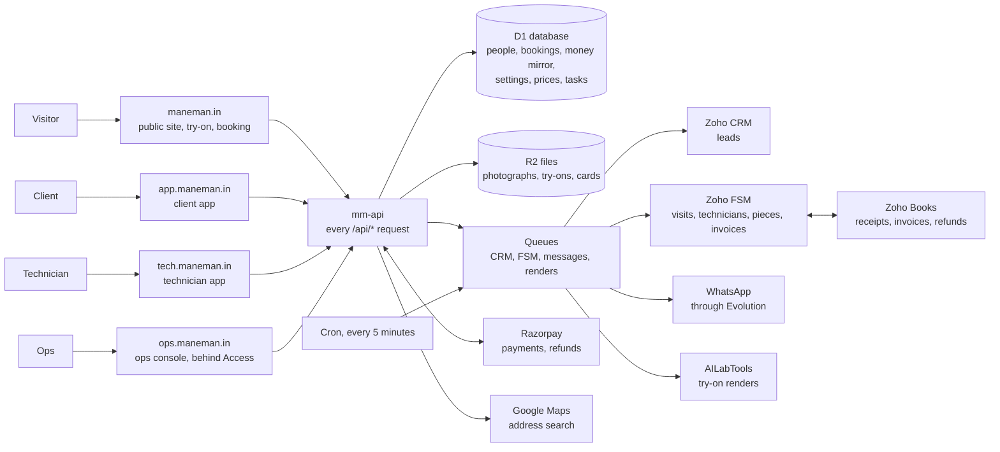

# How Mane Man's platform fits together

A walkthrough for anyone who needs the whole picture: the owner deciding what to change, ops learning what a button does downstream, a developer arriving new. It follows a client from their first try-on to their monthly visits, then lists every action each person can take and what that action changes elsewhere. The README is the developer's way in; this is everyone's.

## The system on one page

Five Cloudflare Workers make up each environment: `mm-api` answers every `/api/*` call on every host and owns the database, the files, the queues and the cron; `mm-site`, `mm-app`, `mm-ops` and `mm-tech` each serve one front end. A request writes the database and answers at once; the slow work (Zoho, WhatsApp, the try-on's renders) goes onto a queue, and the cron puts back anything that went quiet. That is why the apps stay quick when Zoho is slow, and why nothing is lost when a vendor is down: the database is where every retry starts.

**Staging and production.** Staging (`staging.maneman.in` and its three siblings, all behind Cloudflare Access) runs everything on test money and the owner's real Zoho org. Production runs the Phase 1 API and a placeholder page until the owner's go-ahead; `docs/go-live.md` is the order in which it is switched on, the site first and the apps later.

## Who uses what

| Person     | Where                       | How they sign in                                             | What they do there                                                                                                        |
| ---------- | --------------------------- | ------------------------------------------------------------ | ------------------------------------------------------------------------------------------------------------------------- |
| Visitor    | The public site             | Nobody signs in; forms carry Cloudflare Turnstile            | Tries a look on a photograph, books a consultation, joins a waitlist where we do not serve yet, opens a friend's invite   |
| Client     | The client app              | A six-digit code on WhatsApp, then a 90-day session          | Sees their visits, photographs, payments and documents; books, pays, moves and cancels; shares an invite; manages consent |
| Technician | The technician app, offline | A code on WhatsApp to a number FSM lists, bound to one phone | Sees today's and tomorrow's jobs; checks in at the door; photographs, checklist, consumables, piece, outcome              |
| Ops        | The ops console             | Cloudflare Access, by e-mail                                 | Dispatch, clients, rulings, queues, prices, services, rules and the service area                                          |
| Owner      | The console, Zoho, Razorpay | As ops, and the vendors' own logins                          | Sets prices and rules, approves words, runs the go-live checklist                                                         |

## Where each fact lives

A fact has one home, and every other place reads it from there.

| Fact                                         | Its home                                                          | Copied to                                                                           |
| -------------------------------------------- | ----------------------------------------------------------------- | ----------------------------------------------------------------------------------- |
| A person, their consents, their address      | D1                                                                | The CRM (as a lead), FSM (as a contact)                                             |
| Prices, services, rules, the service area    | D1, set in the console                                            | The site and the apps read them; FSM's catalogue follows prices once the push is on |
| A visit: its time, its technician, its state | Zoho FSM                                                          | D1's mirror, kept current by FSM's webhook and a reconciliation                     |
| A payment or a refund                        | Razorpay                                                          | D1's mirror, from Razorpay's signed webhook; Books, as a record                     |
| A tax invoice, a receipt                     | Zoho Books (raised by FSM)                                        | Streamed to the client app, never copied                                            |
| A technician, their zone                     | Zoho FSM                                                          | D1's mirror, refreshed nightly and at sign-in                                       |
| A piece of hair system in wear               | Zoho FSM (an asset)                                               | D1, with our own replacement due date                                               |
| Photographs, try-on looks, referral cards    | R2                                                                | Visit photographs are also attached in FSM                                          |
| Tasks for ops                                | Nowhere: each is read from the queues it comes from when ops look |                                                                                     |

## A client's life, step by step

**1. The try-on.** A visitor opens `/try`, agrees to the photograph's notice, uploads a photograph and chooses a look. The photograph goes to R2, the render to AILabTools (billed per image), and the look comes back to R2. At the end the site asks for a name and number to send the result on WhatsApp: that creates the person, their two try-on consents and a lead the CRM marks "Try-on — delivery only", never chased. The photograph is deleted an hour after its last render; the look after fourteen days, unless the person books a visit, when a small copy of the photograph and the look are kept for their account (ADR 0084).

**2. The consultation.** On `/book`, or on a friend's invite at `/r/CODE`, the visitor checks their pincode. Where we serve it, they give their full address, a day and a window, and book a free consultation; where we do not, they join the waitlist for their area. A booking writes the person, their consent to WhatsApp about the visit, their address and a lead for the CRM. With self-serve booking on, a technician's window is held and the visit is written to FSM (contact, work order, appointment) within seconds, and the confirmation goes on WhatsApp. With it off, the booking is a request on ops' Tasks board, which ops book in FSM by hand. An invite records who sent it.

**3. Before the visit.** The client can sign in to the app with a code on WhatsApp. Home shows the visit, and asks for the address if there is none. From 6 pm the day before, the client gets a reminder and the technician's phone unlocks the address and the client's card. Ops can move the visit or give it to another technician on the dispatch board; the client is told.

**4. The consultation visit.** The technician taps "I have arrived" at the door: the phone's location is measured against the address, and a check-in that passes marks the visit Dispatched in FSM and tells the client he is there. He starts the job, takes the before photographs, and closes it. If nobody answers, he may close it as a no-show once the wait has run out (15 minutes by default), and ops rule on it.

**5. The first fit.** Once the consultation is closed, the app offers the first fit. The client chooses a day and a window, sees the price, taps to pay, and pays in Razorpay's Checkout; the window is held for ten minutes while they do. Razorpay tells us the payment was captured, and the visit is written to FSM; the receipt comes on WhatsApp, and Books' receipt opens in the app a little later. On the day, the technician photographs before and after, ticks the checklist, records the consumables used, types the piece's label (which becomes an asset in FSM with its replacement due date, 180 days out by default), and closes the job as done.

**6. After the fit.** FSM raises the tax invoice from its catalogue. We send it only if its total equals what the client paid; otherwise it stays a draft for ops. The payment is applied to it in Books, and the client opens the invoice in the app. If the client came through an invite, the referral is checked for fraud signals and each side gets three free visits; a suspicious one waits for ops. The client can now book service visits and replacements, and share their own invite from Refer.

**7. Service visits and replacements.** Each is booked and paid in the app like the first fit, or covered by a referral credit. Moving or cancelling is free more than 24 hours ahead; inside 24 hours a first fit costs a late fee of Rs. 4,000, a replacement Rs. 3,000, a paid service visit is kept, and a credit is lost (placeholder figures the owner confirmed; ops set them). When the piece falls due, Home says so and ops see a replacement to order.

**8. Leaving.** A client can download their data, raise a grievance, switch any consent off, change their number (ops confirm it), or ask to be erased. Ops have seven days to erase: the person is blanked, their photographs and cards deleted, the CRM lead blanked and the FSM contact anonymised. Invoices, payments and visits stay as records the law requires.

## Actions and what they change

### A visitor

| Action                     | What it changes                                                                                                                                                                      |
| -------------------------- | ------------------------------------------------------------------------------------------------------------------------------------------------------------------------------------ |
| Tries a look               | A try-on job and its files; one render billed; a daily ceiling counts it                                                                                                             |
| Gives a number at the gate | A person (not to be contacted), two consents, a CRM lead "Try-on — delivery only", the result on WhatsApp                                                                            |
| Books a consultation       | A person, a consent, an address, a CRM lead and a notice to the team's chat; a held window and an FSM visit (self-serve on) or a Tasks request (off); a referral record on an invite |
| Joins a waitlist           | A waitlist entry, its consents, a WhatsApp confirmation, a CRM lead "Waitlist"; told on WhatsApp when their pincode is served                                                        |

### A client

| Action               | What it changes                                                                                                                                                                            |
| -------------------- | ------------------------------------------------------------------------------------------------------------------------------------------------------------------------------------------ |
| Saves an address     | The address and, where a building was chosen, its map pin; FSM's contact and the CRM lead follow; unblocks booking; clears ops' "Address to confirm" task                                  |
| Books and pays       | A held window, a Razorpay order, the two photograph consents the pay step shows; on payment, the FSM visit, the WhatsApp receipt, Books' record; a credit used instead where they have one |
| Moves a visit        | FSM's appointment moved; a late fee asked for and paid inside 24 hours, or a paid service visit kept and a new one paid; a WhatsApp confirmation                                           |
| Cancels a visit      | FSM's work order cancelled; a refund to the card or UPI (all, all but the late fee, or none inside 24 hours for a service visit) recorded in Books; a credit restored or lost              |
| Adds a note          | Shown on the technician's card                                                                                                                                                             |
| Switches a consent   | Which WhatsApp messages they get; turning off referral cards takes their card off every invite                                                                                             |
| Shares an invite     | Their card and link; each open counted; a friend who books is attributed to them                                                                                                           |
| Changes their number | Codes to both numbers, then a request ops confirm; FSM and the CRM follow                                                                                                                  |
| Asks to be erased    | A request with a seven-day countdown on ops' Tasks board                                                                                                                                   |

### A technician

| Action                  | What it changes                                                                                                                        |
| ----------------------- | -------------------------------------------------------------------------------------------------------------------------------------- |
| Signs in                | A session bound to this phone; ops can revoke it, which wipes the phone at its next contact                                            |
| Checks in at the door   | The measured distance and the radius in force; FSM's appointment Dispatched; the client told he has arrived; the no-show wait starts   |
| Starts the job          | FSM's appointment In Progress; the client's app says so                                                                                |
| Takes photographs       | Files in R2, attached to FSM's appointment; the client sees them under Visits and Photos                                               |
| Ticks the checklist     | FSM's job summary; the client's "What was done"                                                                                        |
| Records consumables     | FSM's job summary and our record of what was used                                                                                      |
| Types the piece's label | FSM's asset (the old one made inactive on a replacement); the replacement due date that drives Home's prompt and ops' replacement task |
| Closes as done          | FSM's appointment Completed; then the invoice, Books, a referral's credits, and the client's next bookings                             |
| Closes as partial       | FSM's appointment Terminated with the reason; ops' "Visit left partly done" task until another visit is booked                         |
| Closes as a no-show     | FSM's appointment Terminated; a case in ops' No-shows queue with the evidence                                                          |

Every step is saved on the phone first and sent in order when there is signal, so a basement does not stop a job.

### Ops

| Action                              | What it changes                                                                                                                                                   |
| ----------------------------------- | ----------------------------------------------------------------------------------------------------------------------------------------------------------------- |
| Moves or reassigns a visit          | FSM first, then our mirror; the client told on WhatsApp; the technician's phone shows the change; a "Call about a move" task only where the message cannot go     |
| Records leave                       | Those days refused to every booking and move; the jobs already booked on them listed as tasks                                                                     |
| Revokes a phone                     | The technician signed out and the phone wiped at its next contact                                                                                                 |
| Rules on a no-show                  | Charge keeps what the visit took; waive refunds the payment and returns the credit; the client told either way, never ops' reason                                 |
| Rules on a held referral            | Approve grants both sides their credits and tells them; reject tells them                                                                                         |
| Serves a pincode                    | The site books there instead of waitlisting; everyone on its waitlist who asked is told                                                                           |
| Confirms or rejects a number change | The person's number, and FSM and the CRM with it; the client sees the decision and its reason                                                                     |
| Erases a client                     | Everything in "Leaving" above                                                                                                                                     |
| Adjusts credits                     | The client's balance, for a correction or goodwill                                                                                                                |
| Opens a client's photographs        | An audit entry naming who opened them, listed beneath the photographs                                                                                             |
| Sets a price                        | The site, the landing and the app from its day; a hold keeps the price it was made at; FSM's catalogue checked hourly, and pushed once the owner switches that on |
| Sets a rule                         | The check-in radius, the no-show wait, when an address unlocks, how long each task may wait, each base's replacement cycle; in force within a minute, no release  |
| Sets the service area               | Where the site books and where it waitlists                                                                                                                       |

## What changes without a release

Ops change these in the console, and each is in force within a minute: prices (each from the day it applies, so nothing already sold moves), the rules above, and the service area. Everything else is code and needs a release, and the owner has ruled that every policy should move into the console (`docs/open-points.md`, item 12; `docs/implementation-plan-2026-09-27.md`, C1).

## Behind the scenes

**The queues.** One carries leads and erasures to the CRM; one carries bookings, a technician's steps, contact changes and erasures to FSM, strictly in order and retried; one carries every WhatsApp message except login codes, checking consent at the moment it sends; one runs the try-on's renders.

**The cron, every five minutes.** It puts back on a queue what went quiet; lets go of holds nobody paid for; reconciles FSM's visits (a page each run, the whole calendar each night); checks FSM's catalogue against the price book each hour; raises and sends invoices; records payments and refunds in Books; sends tomorrow's reminders from 6 pm; settles referrals; checks the WhatsApp bridge; and alerts ops once when something needs a person.

**Alerts.** A failure that needs a person is an alert, told once to the team's chat, and closed when it is put right; `docs/runbook.md` says what each one means and what to do.
