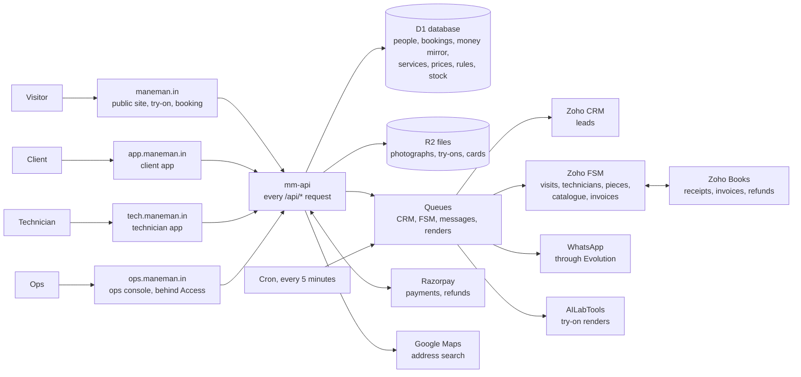

# How Mane Man's platform fits together

A walkthrough for anyone who needs the whole picture: the owner deciding what to change, ops learning what a button does downstream, a developer arriving new. It follows a client from their first try-on to their monthly visits, then lists every action each person can take and what that action changes elsewhere. The README is the developer's way in; this is everyone's.

## The system on one page

Five Cloudflare Workers make up each environment: `mm-api` answers every `/api/*` call on every host and owns the database, the files, the queues and the cron; `mm-site`, `mm-app`, `mm-ops` and `mm-tech` each serve one front end. A request writes the database and answers at once; the slow work (Zoho, WhatsApp, the try-on's renders) goes onto a queue, and the cron puts back anything that went quiet. That is why the apps stay quick when Zoho is slow, and why nothing is lost when a vendor is down: the database is where every retry starts.

**Staging and production.** Staging (`staging.maneman.in` and its three siblings, all behind Cloudflare Access) runs everything on test money and the owner's real Zoho org. Production runs the Phase 1 API and a placeholder page until the owner's go-ahead; `docs/go-live.md` is the order in which it is switched on, the site first and the apps later.

**The console is the source of truth.** The owner ruled on 27 September 2026 that every price, service and policy is an ops update, not a tech update (ADR 0025, items 66 and 67). What the console already holds is listed under "What changes without a release"; what is still code is `docs/archive/implementation-plan-2026-09-27.md`, C1.

## Who uses what

| Person     | Where                       | How they sign in                                             | What they do there                                                                                                                |
| ---------- | --------------------------- | ------------------------------------------------------------ | --------------------------------------------------------------------------------------------------------------------------------- |
| Visitor    | The public site             | Nobody signs in; forms carry Cloudflare Turnstile            | Tries a look on a photograph; books a consultation, or the consultation and fit in one visit; joins a waitlist; opens an invite   |
| Client     | The client app              | A six-digit code on WhatsApp, then a 90-day session          | Sees their visits, photographs, payments and documents; books the next visit it offers, pays, moves and cancels; shares an invite |
| Technician | The technician app, offline | A code on WhatsApp to a number FSM lists, bound to one phone | Sees today's and tomorrow's jobs; checks in at the door; photographs, checklist, consumables, piece, outcome                      |
| Ops        | The ops console             | Cloudflare Access, by e-mail                                 | Dispatch, clients, rulings, queues; services and prices, rules, the service area, the job sheet, consumables and stock            |
| Owner      | The console, Zoho, Razorpay | As ops, and the vendors' own logins                          | Sets services, prices and rules, approves words, runs the go-live checklist                                                       |

## Where each fact lives

A fact has one home, and every other place reads it from there.

| Fact                                                 | Its home                                                           | Copied to                                                                                                                              |
| ---------------------------------------------------- | ------------------------------------------------------------------ | -------------------------------------------------------------------------------------------------------------------------------------- |
| A person, their consents, their address              | D1                                                                 | The CRM (as a lead), FSM (as a contact)                                                                                                |
| Services: each one's kind, name, length and FSM item | D1, set in the console (ADR 0085)                                  | The app offers them and the site shows their prices; FSM's catalogue holds each as an item, made and renamed by the push once it is on |
| Prices, dated, for each service                      | D1's price book, set in the console (ADR 0073)                     | The site, the landing and the app; a hold copies the price it sold at; FSM's items follow once the push is on                          |
| Rules, the service area, the next visit's days       | D1, set in the console (ADR 0061, ADR 0086)                        | Read by the API within a minute                                                                                                        |
| The job sheet: checklists and partial reasons        | D1, set in the console (ADR 0087)                                  | The technician's card for each job                                                                                                     |
| Consumables and what each service is expected to use | D1, set in the console (ADR 0087)                                  | The technician's consumables step; FSM's catalogue holds each as a part at Rs. 0 once the push is on                                   |
| Stock in each technician's kit and the central store | D1's ledger, ours alone: FSM keeps no stock without Zoho Inventory | Nowhere                                                                                                                                |
| A visit: its time, its technician, its state         | Zoho FSM                                                           | D1's mirror, kept current by FSM's webhook and a reconciliation                                                                        |
| A payment or a refund                                | Razorpay                                                           | D1's mirror, from Razorpay's signed webhook; Books, as a record                                                                        |
| A tax invoice, a receipt                             | Zoho Books (raised by FSM)                                         | Streamed to the client app, never copied                                                                                               |
| A technician, their zone                             | Zoho FSM                                                           | D1's mirror, refreshed nightly and at sign-in                                                                                          |
| A piece of hair system in wear                       | Zoho FSM (an asset)                                                | D1, with our own replacement due date                                                                                                  |
| Photographs, try-on looks, referral cards            | R2                                                                 | Visit photographs are also attached in FSM                                                                                             |
| Tasks for ops                                        | Nowhere: each is read from the queues it comes from when ops look  | Whose each is, and a visit left partly done that ops closed, in D1 by the task's group and row (ADR 0092)                              |

The CRM holds no products. FSM's own sync carries its catalogue to Books, and to the CRM where that integration is on; we write none there (the owner's ruling, item 1).

## A client's life, step by step

**1. The try-on.** A visitor opens `/try`, agrees to the photograph's notice, uploads a photograph and chooses a look. Before the look is made the site asks for a name and number, since the look goes to WhatsApp only and is never shown on the site (ADR 0104): that creates the person, their two try-on consents and a lead the CRM marks "Try-on — delivery only", never chased. Then the render goes to AILabTools (billed per image), the look comes back to R2, and the WhatsApp message carries it. While WhatsApp is off, as in production until its number goes live, the try-on does not run. The photograph is deleted an hour after its last render; the look after fourteen days, unless the person books a visit, when a small copy of the photograph and the look are kept for their account (ADR 0084).

**2. The consultation.** On `/book`, or on a friend's invite at `/r/CODE`, the visitor checks their pincode. Where we serve it, they choose a consultation, or the consultation and their fit in one visit (three hours, in the morning or the afternoon); then their full address, a day and a window. Where we do not serve it, they join the waitlist for their area. A booking writes the person, their consent to WhatsApp about the visit, their address and a lead for the CRM. The site takes no money: a fit booked later is booked and paid in the app, and one in the same visit is paid for once the client is fitted, by a Razorpay payment link texted to them (ADR 0105). With self-serve booking on, a technician's window is held for the consultation's length and the visit is written to FSM (contact, work order, appointment) within seconds, and the confirmation goes on WhatsApp. With it off, the booking is a request on ops' Tasks board, which ops book in FSM by hand. An invite records who sent it.

**3. Before the visit.** The client can sign in to the app with a code on WhatsApp. Home shows the visit, and asks for the address if there is none. From 6 pm the day before, the client gets a reminder and the technician's phone unlocks the address and the client's card. Ops can move the visit or give it to another technician on the dispatch board; the client is told.

**4. The consultation visit.** The technician taps "I have arrived" at the door: the phone's location is measured against the address, and a check-in that passes marks the visit Dispatched in FSM and tells the client he is there. He starts the job, works through its steps (the photographs, and the checklist ops set for a consultation) and closes it. If nobody answers, he may close it as a no-show once the wait has run out (15 minutes by default), and ops rule on it. A consultation and fit in one visit runs the consultation's checklist and the fit's, and at the piece step the client chooses the product with him, or decides against it; closed as done, the client is texted a Razorpay payment link for the product, which the Tasks board lists as Payment owed until it is paid, or the visit ends as a consultation, with nothing to pay (ADR 0105).

**5. The first fit.** Once the consultation is closed, the app offers the first fit, from the day the lead time allows (0 days to begin with), in the consultation's window (none after an evening consultation, since a fit cannot start in the evening). Where more than one first-fit service is offered, the client picks one, each with its length and price; the sheet opens on the offered day. The client sees the price, taps to pay and pays in Razorpay's Checkout; the window is held for ten minutes while they do, for the service's own length. Razorpay tells us the payment was captured, and the visit is written to FSM on the service's own item; the receipt comes on WhatsApp, and Books' receipt opens in the app a little later. If FSM refuses it five times running, nothing is refunded: the visit keeps its window and the payment, Home says it is being booked, the cron tries FSM every hour for a day, and ops book it or refund it from the console (ADR 0095). A client consulted and not fitted, with nothing booked seven days after the consultation (a one visit they declined included), appears on the Tasks board as First fit to book, which ops book from the row in the consultation's window; it goes as soon as anything is booked. On the day, the technician photographs before and after, ticks the checklist ops set for a first fit, records the consumables used (the steppers start at what the service is expected to use, and what he confirms leaves his kit), types the piece's label (which becomes an asset in FSM with its replacement due date, 180 days out by default), and closes the job as done.

**6. After the fit.** FSM raises the tax invoice from its catalogue. We send it only if its total equals what the client paid; otherwise it stays a draft for ops. The payment is applied to it in Books, and the client opens the invoice in the app. If the client came through an invite, the referral is checked for fraud signals and each side gets three free visits; a suspicious one waits for ops. The app now offers the next service visit, due 30 days after the fit, in the same window; the client can share their own invite from Refer.

**7. Service visits and replacements.** Each visit that closes (a first fit, a service or a replacement) makes the app offer the next service, due 30 days later; where the piece in wear falls due first, it offers the replacement instead. Nothing books it for the client and the technician books none: the client books and pays in the app like the first fit, or a referral credit covers it. If nothing is booked, a WhatsApp reminder goes 7 days before the due day, and 7 days after it the client appears on the Tasks board as At-risk. Home puts the most pressing prompt first: an address while something is booked, then the next service due, then the piece falling due (with "Book the replacement" and a page on what a replacement involves), then an invoice issued in the last 14 days. Moving or cancelling is free more than 24 hours ahead; inside 24 hours a first fit costs a late fee of Rs. 4,000, a replacement Rs. 3,000, a paid service visit is kept, and a credit is lost (placeholder figures the owner confirmed; ops set them as prices).

**8. Leaving.** A client can download their data, raise a grievance, switch any consent off, change their number (ops confirm it), or ask to be erased. Ops have seven days to erase: the person is blanked, their photographs and cards deleted, the CRM lead blanked and the FSM contact anonymised. Invoices, payments and visits stay as records the law requires.

## Actions and what they change

### A visitor

| Action                                      | What it changes                                                                                                                                                                      |
| ------------------------------------------- | ------------------------------------------------------------------------------------------------------------------------------------------------------------------------------------ |
| Gives a number at the gate                  | A person (not to be contacted), two consents, a CRM lead "Try-on — delivery only"; only then is the look made                                                                        |
| Tries a look                                | A try-on job and its files; one render billed; a daily ceiling counts it; the look on WhatsApp, never on the site                                                                    |
| Books a consultation                        | A person, a consent, an address, a CRM lead and a notice to the team's chat; a held window and an FSM visit (self-serve on) or a Tasks request (off); a referral record on an invite |
| Books the consultation and fit in one visit | All of the above, for the first fit's three hours in the morning or the afternoon; nothing is paid until the client is fitted, by a payment link texted after the visit              |
| Joins a waitlist                            | A waitlist entry, its consents, a WhatsApp confirmation, a CRM lead "Waitlist"; told on WhatsApp when their pincode is served                                                        |

### A client

| Action                       | What it changes                                                                                                                                                                                               |
| ---------------------------- | ------------------------------------------------------------------------------------------------------------------------------------------------------------------------------------------------------------- |
| Saves an address             | The address and, where a building was chosen, its map pin; FSM's contact and the CRM lead follow; unblocks booking; clears ops' "Address to confirm" task                                                     |
| Books the next visit offered | A held window of the service's length on the offered day; a Razorpay order; on payment, the FSM visit on the service's item, the WhatsApp receipt, Books' record; the reminder and the At-risk task fall away |
| Chooses among services       | Which service is held, priced and written to FSM; the hold keeps its price, late fee and length whatever ops change later                                                                                     |
| Books and pays with a credit | The same visit, with a credit used instead of a payment                                                                                                                                                       |
| Books a replacement          | As any visit, from Home's prompt once the piece's due month is within the horizon (45 days)                                                                                                                   |
| Moves a visit                | FSM's appointment moved; a late fee asked for and paid inside 24 hours, or a paid service visit kept and a new one paid; a WhatsApp confirmation                                                              |
| Cancels a visit              | FSM's work order cancelled; a refund to the card or UPI (all, all but the late fee, or none inside 24 hours for a service visit) recorded in Books; a credit restored or lost                                 |
| Adds a note                  | Shown on the technician's card                                                                                                                                                                                |
| Switches a consent           | Which WhatsApp messages they get, the next service's reminder included; turning off referral cards takes their card off every invite                                                                          |
| Shares an invite             | Their card, sent as a photograph with the invite as its caption where the phone can share files; each open counted; a friend who books is attributed to them                                                  |
| Changes their number         | Codes to both numbers, then a request ops confirm; FSM and the CRM follow                                                                                                                                     |
| Downloads their data         | A file of everything held: visits, payments, consents, messages, what they asked for on the site, and who in ops opened their photographs                                                                     |
| Asks to be erased            | A request with a seven-day countdown on ops' Tasks board                                                                                                                                                      |

### A technician

| Action                  | What it changes                                                                                                                                                |
| ----------------------- | -------------------------------------------------------------------------------------------------------------------------------------------------------------- |
| Signs in                | A session bound to this phone; ops can revoke it, which wipes the phone at its next contact. The code goes only to the number of an active technician          |
| Checks in at the door   | The measured distance and the radius in force; FSM's appointment Dispatched; the client told he has arrived; the no-show wait starts                           |
| Starts the job          | FSM's appointment In Progress; the client's app says so                                                                                                        |
| Takes photographs       | Files in R2, attached to FSM's appointment; the client sees them under Visits and Photos                                                                       |
| Ticks the checklist     | The list ops set for that kind of visit; FSM's job summary; the client's "What was done"                                                                       |
| Records consumables     | FSM's job summary (never the invoice); our record of what was used, at that day's cost; each one out of his kit's stock, once however often the step is resent |
| Types the piece's label | FSM's asset (the old one made inactive on a replacement); the replacement due date that drives Home's prompt, the next visit offered and ops' replacement task |
| Closes as done          | FSM's appointment Completed; then the invoice, Books, a referral's credits, and the client's next visit offered in the app                                     |
| Closes as partial       | FSM's appointment Terminated with a reason from ops' list; ops' "Visit left partly done" task until another visit is booked, or ops close it with a reason     |
| Closes as a no-show     | FSM's appointment Terminated; a case in ops' No-shows queue with the evidence                                                                                  |

Every step is saved on the phone first and sent in order when there is signal, so a basement does not stop a job.

### Ops

| Action                                | What it changes                                                                                                                                                                                                                                                                                                                                                                                     |
| ------------------------------------- | --------------------------------------------------------------------------------------------------------------------------------------------------------------------------------------------------------------------------------------------------------------------------------------------------------------------------------------------------------------------------------------------------- |
| Moves or reassigns a visit            | FSM first, then our mirror; the client told on WhatsApp; the technician's phone shows the change; a "Call about a move" task only where the message cannot go                                                                                                                                                                                                                                       |
| Records leave                         | Those days refused to every booking and move; the jobs already booked on them listed as tasks                                                                                                                                                                                                                                                                                                       |
| Revokes a phone                       | The technician signed out and the phone wiped at its next contact                                                                                                                                                                                                                                                                                                                                   |
| Rules on a no-show                    | Charge costs what the booking was sold to cost a no-show, the late fee kept, the visit kept or its credit spent, and gives back the rest; waive refunds the payment and returns the credit; the client told either way, never ops' reason                                                                                                                                                           |
| Rules on a disputed charge            | Refund gives back what the charge took, the money and the credit; uphold keeps it; the client told either way, never ops' reason                                                                                                                                                                                                                                                                    |
| Acts on a booking FSM refused         | Try FSM again: booked as the queue would book it, the client told. Stop trying: no more hourly tries, while ops book it in FSM by hand. Link the visit booked in FSM by hand: the booking becomes that visit, with its payment, and a work order an earlier try left is cancelled. Refund it: FSM's work order cancelled, the payment refunded in full, the slot freed, the client told on WhatsApp |
| Rules on a held referral              | Approve grants both sides their credits and tells them; reject tells them                                                                                                                                                                                                                                                                                                                           |
| Takes, gives or hands back a task     | Whose it is on the Tasks board, audited; only a member of staff who has used the console in the last 90 days can be given one                                                                                                                                                                                                                                                                       |
| Closes a visit left partly done       | Its task leaves the Tasks board for good, with the reason kept under who closed it and shown on the client's page                                                                                                                                                                                                                                                                                   |
| Records an address given on the phone | The client's address, as their own save makes it (the pin, FSM's contact and the CRM lead), marked as given to ops; their profile says so; clears "Address to confirm"                                                                                                                                                                                                                              |
| Serves a pincode                      | The site books there instead of waitlisting; everyone on its waitlist who asked is told                                                                                                                                                                                                                                                                                                             |
| Confirms or rejects a number change   | The person's number, and FSM and the CRM with it; the client sees the decision and its reason                                                                                                                                                                                                                                                                                                       |
| Erases a client                       | Everything in "Leaving" above                                                                                                                                                                                                                                                                                                                                                                       |
| Adjusts credits                       | The client's balance, for a correction or goodwill                                                                                                                                                                                                                                                                                                                                                  |
| Opens a client's photographs          | An audit entry naming who opened them, listed beneath the photographs and in the client's data export                                                                                                                                                                                                                                                                                               |
| Adds a service                        | A new choice within its kind, offered to clients once it is priced; FSM's item looked for by its name, made by the push once it is on; until then bookings go on the kind's standard item, and ops are told once                                                                                                                                                                                    |
| Renames, re-times, reorders a service | What clients, ops and FSM call it (its code, and so its prices, stay); how long new bookings of it take and the day's capacity with it; the order the console and the app list it in. Nothing sold moves                                                                                                                                                                                            |
| Retires or restores a service         | Clients stop seeing it from that day; what is booked stays. A kind's last service cannot be retired until another is priced                                                                                                                                                                                                                                                                         |
| Sets or corrects a price              | The site, the landing and the app from its day; a hold keeps the price it was made at; FSM's item checked hourly, and pushed once the owner switches that on                                                                                                                                                                                                                                        |
| Sets a rule                           | The check-in radius, the no-show wait, when an address unlocks, how long each task may wait, each base's replacement cycle; in force within a minute, no release                                                                                                                                                                                                                                    |
| Sets the next visit's days            | The first fit's lead time, the service cadence (30), the reminder (7 before), At-risk (7 after), First fit to book (7), the booking horizon (45) and Home's invoice fortnight (14)                                                                                                                                                                                                                  |
| Sets the service area                 | Where the site books and where it waitlists                                                                                                                                                                                                                                                                                                                                                         |
| Sets the job sheet                    | Each kind of visit's checklist and the partial reasons, on every technician's next card; a reason's words on the Tasks board; an item taken off is retired, so a step queued offline still lands                                                                                                                                                                                                    |
| Adds, changes or retires a consumable | What the technician may record, at what cost to us, and when stock is low; its FSM part added or renamed by the push once it is on, else ops are told once to add it by hand                                                                                                                                                                                                                        |
| Sets a service's expected use         | Where the technician's steppers start for that service                                                                                                                                                                                                                                                                                                                                              |
| Records a delivery, transfer or count | The central store's and each kit's stock; a count writes the difference; a write-off records a loss; a place at or below its level alerts once until it is restocked                                                                                                                                                                                                                                |

## What changes without a release

Ops change these in the console, and each is in force within a minute: services and their names, lengths, order and retirement; prices, each from the day it applies, so nothing already sold moves; the rules; the next visit's days; the service area; the job sheet; the consumables and each service's expected use; and stock. Everything else is code and needs a release. The owner has ruled that every policy should move into the console: the move and cancel terms, the no-show charges, the reminder's hour and the rest are listed in `docs/open-points.md`, item 12, and `docs/archive/implementation-plan-2026-09-27.md`, C1.

## Behind the scenes

**The queues.** One carries leads and erasures to the CRM; one carries bookings, a technician's steps, contact changes, catalogue pushes and erasures to FSM, strictly in order and retried; one carries every WhatsApp message except login codes, checking consent at the moment it sends; one runs the try-on's renders.

**The cron, every five minutes.** It puts back on a queue what went quiet; lets go of holds nobody paid for; reconciles FSM's visits (a page each run, the whole calendar each night); checks FSM's catalogue each hour against the services, their prices and the consumables, and pushes the differences once the owner switches that on; raises and sends invoices; records payments and refunds in Books; sends tomorrow's visit reminders and the next service's reminders from 6 pm; settles referrals; checks the WhatsApp bridge; and alerts ops once when something needs a person.

**Alerts.** A failure that needs a person is an alert, told once to the team's chat, and closed when it is put right: an FSM item or part missing, a service booked on its kind's standard item, stock low in a kit or the store, an invoice that does not match what was paid. `docs/runbook.md` says what each one means and what to do.

## Where each piece is decided

| Piece                                     | Decision record                                                     |
| ----------------------------------------- | ------------------------------------------------------------------- |
| Services ops can edit                     | `docs/decisions/0085-services-ops-can-edit.md`                      |
| The next visit, offered in the app        | `docs/decisions/0086-the-next-visit-is-offered.md`                  |
| Consumables, stock and the job sheet      | `docs/decisions/0087-consumables-and-stock.md`                      |
| Prices from the price book                | `docs/decisions/0073-prices-from-the-price-book.md`                 |
| What ops may set in the console           | `docs/decisions/0061-ops-editable-inputs.md`                        |
| A paid hold is kept                       | `docs/decisions/0068-a-paid-hold-is-kept.md`                        |
| The owner's rulings, and every open point | ADR 0025; `docs/open-points.md`; `docs/archive/owner-answers-2026-09-27.md` |
| Going live                                | `docs/go-live.md`; `docs/runbook.md`                                |
